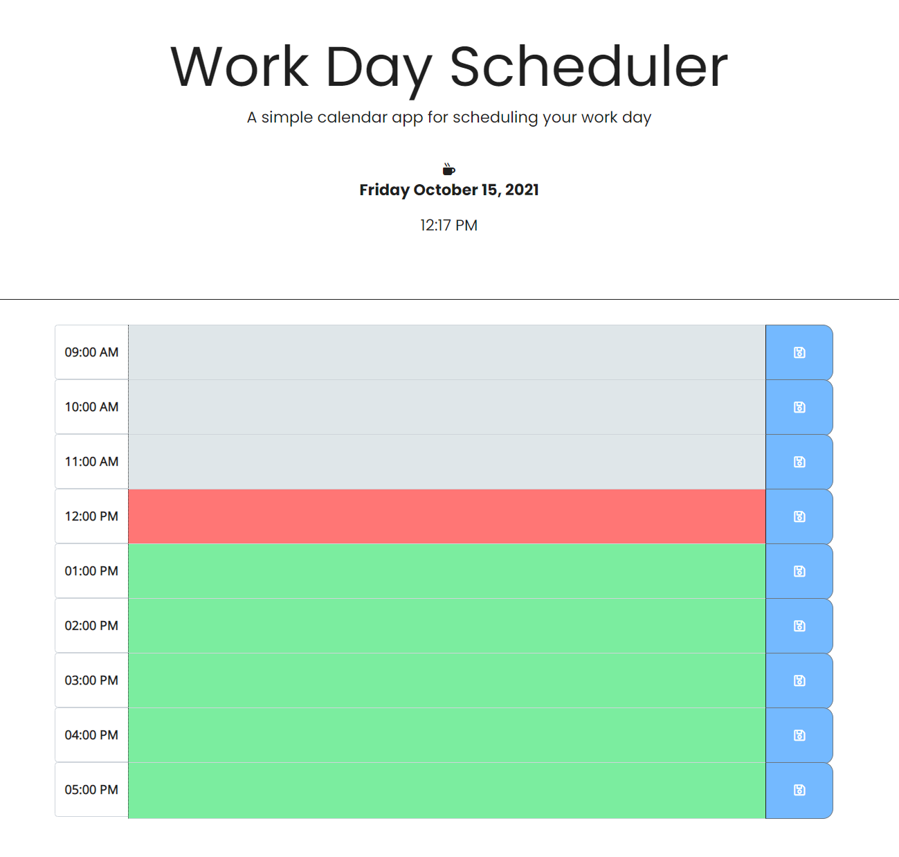

# Work Day Scheduler
## Homework Assignment Week 5

This is a simple calendar application that allows a user to save events for each hour of the day.  This app will run in the browser and feature dynamically updated HTML and CSS powered by jQuery.
* The current day and time will be displayed at the top of the page
* The user will be presented with timeblocks for standard business hours
* Timeblocks are color coded to indicate past, present, or future
* User will be able to enter an event and save it into local storage
* Saved events will persist

